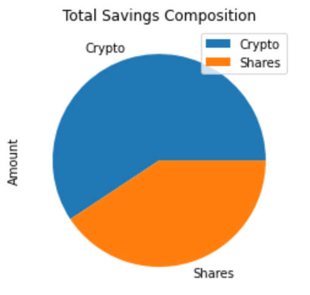
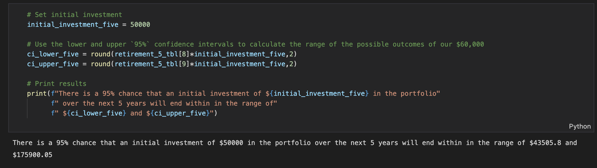
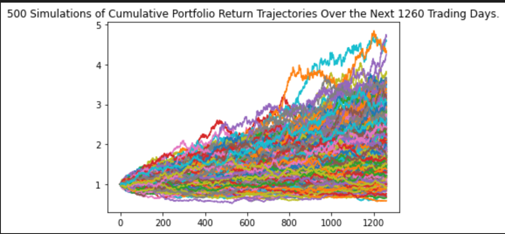
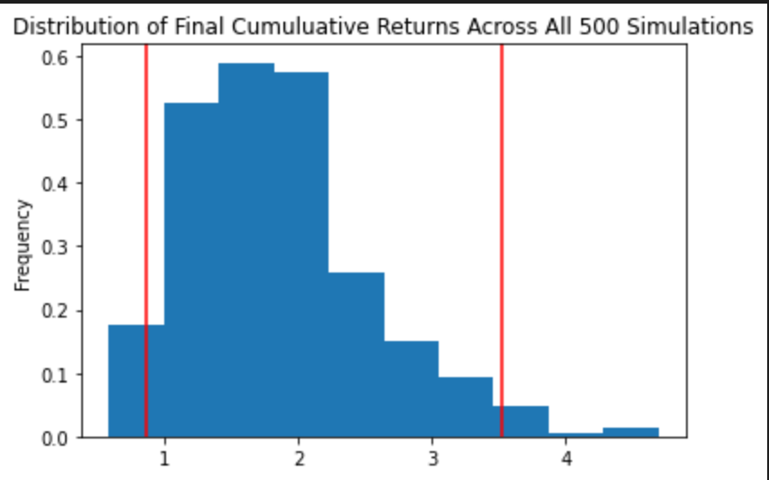

# Financial Planner

## Overview

For this project, I am tasked with developing a financial planning tool for members of a credit union to assess monthly personal finances and to be able to forecast a reasonably good retirement plan based on cryptocurriencies, stocks and bonds.

The first tool allows users to visualize their composed by investments in shares and cryptocurrencies to assess if they have enough money as an emergency fund.

The second tool is a retirement planning tool that uses Alpaca API to fetch historical closing prices for a retirement portfolio composed of stocks and bonds, then runs Monte Carlo simulations to project the portfolio performance at 30 years. You will then use the Monte Carlo data to calculate the expected portfolio returns given a specific initial investment amount.

### Resources

This project utilizes two APIs:

* The **Alpaca Markets API** will be used to pull historical stocks and bonds information.  
    
* The **Alternative Free Crypto API** will be used to retrieve Bitcoin and Ethereum prices.

# Part 1 - Personal Finance Planner

In this section I have developed a personal finance planner application. To develop the personal finance planner prototype, I took into account the following assumptions:

* The average household income for each member of the credit union is $12,000.

* Every union member has a savings portfolio composed of cryptocurrencies, stocks and bonds:

    * Assume the following amount of crypto assets: `1.2` BTC and `5.3` ETH.

    * Assume the following amount of shares in stocks and bonds: `50` SPY (stocks) and `200` AGG (bonds).

Historical Bitcoin and Ethereum prices were fetched using the `requests` library and the **Alternative Free Crypto API**.

## Savings Health Analysis

First, a pie chart of portfolio savings composition is generated.

Then second, `if` conditional statements are used to validate if the current savings are enough for an emergency fund. An ideal emergency fund should be equal to three times the monthly income.

# Part 2 - Retirement Planning

In this section, I use the **Alpaca API** to fetch historical closing prices for a retirement portfolio and then Use the MCForecastTools toolkit to create Monte Carlo simulations to project the portfolio performance at `30` years. I then use the Monte Carlo data to answer questions about the portfolio.

## Monte Carlo Simulation

1. Use the Alpaca API to fetch five years historical closing prices for a traditional `40/60` portfolio using the `SPY` and `AGG` tickers to represent the `60%` stocks (`SPY`) and `40%` bonds (`AGG`) composition of the portfolio. Make sure to convert the API output to a DataFrame and preview the output.

    > *Note*: In Monte Carlo Simulations, getting data as far back as possible matters, because if we simulate using only small amounts of data during a recent time when markets are booming, or instead falling precipitously, a Monte Carlo analysis will inadvertently extrapolate this temporary market movement too far into the future. Getting data over a longer time period mitigates this effect.

2. Configure and execute a Monte Carlo Simulation of `500` runs and `30` years for the `40/60` portfolio.

## 30-Year Monte Carlo Simulations

## Retirement Analysis

For the retirement analysis the following steps were executed:

1. Fetch the summary statistics from the Monte Carlo simulation results.

2. Given an initial investment of `$20,000`, calculate the expected portfolio return in dollars at the `95%` lower and upper confidence intervals.

3. Calculate the expected portfolio return at the `95%` lower and upper confidence intervals based on a `50%` increase in the initial investment.

## Part 3 - Early Retirement

To extend this project further, the retirement plan is adjusted from `30` years to account for an earlier than normal retirement at `5` and `10` years into the future. The portfolio composition of both 5-year and 10-year Monte Carlo simulations have been adjusted to include more risk with an 80/20 split for stocks over bonds.

## Early Retirement Analysis - 5-Year & 10-Yeart Monte Carlo Simulations

### 1. 5-Year Monte Carlo Summary Statistics

### 2. Given an initial investment of `$50,000`, calculate the expected portfolio return in dollars at the `95%` lower and upper confidence intervals.

### 5-Year Monte Carlo Simulations Plots

### 10-Year Monte Carlo Simulations

### 1. 10-Year Monte Carlo Summary Statistics

### 2. Given an initial investment of `$50,000`, calculate the expected portfolio return in dollars at the `95%` lower and upper confidence intervals.

### 10-Year Monte Carlo Simulations Plots

